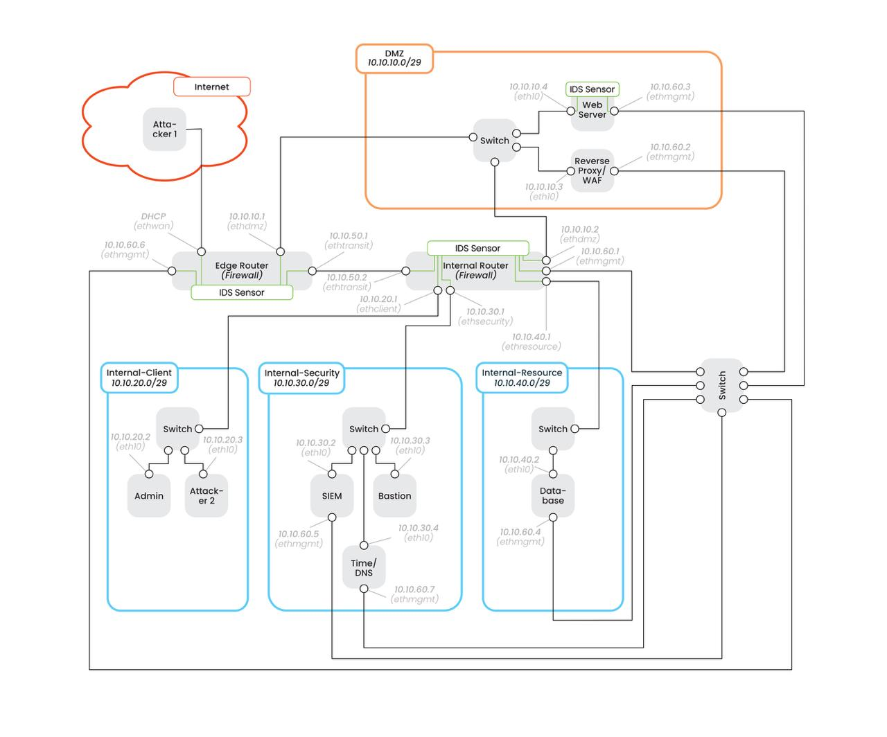

# Sichere Unternehmensnetzwerke (SUN) – DMZ Lab


---

## Executive Overview

This project implements a **fully containerized simulation** of a secure enterprise DMZ (Demilitarized Zone) environment. Developed as part of the *Sichere Unternehmensnetzwerke* (Secure Enterprise Networks) course, the lab provides a realistic testbed for studying network security principles, defense-in-depth strategies, and offensive security techniques.

### Key Features

- **Three-Zone Network Architecture:** Strict segmentation between Internet, DMZ, and Internal zones using `nftables` firewall rules.
- **Defense-in-Depth:** Multi-layered security controls including a Web Application Firewall (WAF), SIEM infrastructure (Grafana Loki + Fluent Bit), IDS (Suricata), and hardened SSH configurations.
- **Production-Like Services:** A Python-based web application fronted by NGINX with ModSecurity, backed by a MariaDB database.
- **Secure Management:** A dedicated Bastion Host for administrative access, enforcing key-based SSH authentication only.
- **Red Team Validation:** Included attack scripts to validate and stress-test the implemented security controls.

### Network Topology Overview



---

## Prerequisites

### Operating System

| Requirement | Details |
|-------------|---------|
| **Preferred OS** | Ubuntu 24.04 LTS |
| **Alternative** | Any Linux distribution with Docker and Containerlab support |

### Hardware Requirements

| Resource | Minimum | Recommended |
|----------|---------|-------------|
| **Disk Space** | 40 GB free | 60+ GB free |
| **RAM** | 6 GB | 8+ GB |
| **CPU Cores** | 2 | 4+ |

### Software Requirements

| Software | Purpose | Installation |
|----------|---------|--------------|
| **Docker** | Container runtime | [docs.docker.com](https://docs.docker.com/engine/install/) |
| **Containerlab** | Network topology orchestration | [containerlab.dev](https://containerlab.dev/install/) |

**Verification Commands:**
```bash
# Verify Docker installation
docker --version

# Verify Containerlab installation
containerlab version
```

---

## Installation & Setup

### Quick Start

The project includes an automated setup script that handles building all container images and deploying the network topology.

```bash
# Clone the repository
git clone https://github.com/davidseitz/SichereDMZ.git
cd SichereDMZ

# Deploy the lab environment
# Prompts your for your admin credentials to create the bridge to connect to internet
./setup.sh start
```

### Setup Script Options

| Command | Description |
|---------|-------------|
| `./setup.sh start` | Build all containers and deploy the lab |
| `./setup.sh stop` | Destroy the lab topology |
| `./setup.sh restart` | Reset the lab to a clean state |
| `./setup.sh test` | Run the automated verification test suite |

The `restart` option is particularly useful for returning the environment to a known-good state between experiments or after security testing.

### Post-Deployment Verification

After deployment, verify that all containers are running:

```bash
# List all running containers
docker ps --format "table {{.Names}}\t{{.Status}}\t{{.Ports}}"

# Expected: 15+ containers with "Up" status
```

---

## Security Verification (Red Team Attacks)

The project includes several security assessment tools designed to validate the effectiveness of the implemented security controls. These tools simulate realistic attack vectors to test the resilience of the infrastructure.


### 1. OWASP ZAP Vulnerability Scan

**Scripts:** `attacks/zap_scan_baseline.sh`, `attacks/zap_scan_full.sh`

Automated vulnerability scanning using OWASP ZAP (Zed Attack Proxy) to identify common web application vulnerabilities including SQL injection, XSS, CSRF, and OWASP Top 10 issues.

**Reports:** Generated HTML reports are stored in `attacks/reports/`

### 1. WAF Rate Limiting Stress Test

**Script:** `attacks/python-scripts/flood_users_rate_limited.py`

This tool tests the availability and rate limiting capabilities of the Web Application Firewall (WAF). It simulates an authenticated bot attack that attempts to create multiple user accounts while bypassing CAPTCHA protections.

**Attack Characteristics:**
- CAPTCHA solving via OCR (OpenCV + Tesseract)
- User-Agent rotation to evade bot detection
- Rate-limited requests to test threshold enforcement

**Execution:**
```bash
# From within the attacker container
docker exec -it clab-security_lab-attacker_1 python3 /home/attacker/attacks/flood_users_rate_limited.py
```

### 3. SIEM Cardinality Exploitation

**Scripts:**
- Wrapper: `attacks/loki_attack_wrapper.sh`
- Core Attack: `attacks/python-scripts/loki_cardinality_attack.py`

This advanced attack demonstrates a critical vulnerability in SIEM infrastructure. It targets the Grafana Loki log aggregation system by injecting high-cardinality log streams, causing index bloat, memory exhaustion, and potential denial of service.

**Attack Phases:**
| Phase | Description | Impact |
|-------|-------------|--------|
| **Phase 1** | Cardinality Explosion | Index bloat, +337% memory increase |
| **Phase 2** | Credential Scraping | Authentication bypass via Fluent Bit config exfiltration |

**Execution (Safe Mode):**
```bash
# Verify connectivity and prove access (non-destructive)
./attacks/loki_attack_wrapper.sh --mode safe

# Full cardinality attack (destructive - requires confirmation)
./attacks/loki_attack_wrapper.sh --mode cardinality -n 10000
```

**Documentation:** Detailed analysis available in `attacks/docs/LOKI_ATTACK_DOCUMENTATION.md`


---

## Usage

### Getting Started

1. **Deploy the Lab:**
   ```bash
   # You might need to double check that docker rootless use is configuerd
   ./setup.sh start
   ```

2. **Verify Container Status:**
   ```bash
   docker ps
   ```


3. **Access the Web Application:**
   ```bash
   # Via WAF (HTTPS)
   curl -k https://10.10.10.3 -H "Host: web.sun.dmz"
   ```

### Running Tests

The project includes automated security tests to verify the proper functioning of all security controls:

```bash
# Run the complete test suite
sudo ./setup.sh test

# Or run individual test scripts
./tests/test_edge_firewall.sh
./tests/test_waf.sh
./tests/test_ssh.sh
```

---

## Project Structure

```
SichereDMZ/
├── topology.clab.yml       # Containerlab topology definition
├── setup.sh                # Main setup/deployment script
├── attacks/                # Red Team attack scripts
│   ├── python-scripts/     # Python-based attack tools
│   ├── loki_stages/        # SIEM attack benchmarking
│   └── docs/               # Attack documentation
├── config/                 # Configuration files
│   ├── firewalls/          # nftables firewall rules
│   ├── waf_setup/          # ModSecurity/NGINX WAF config
│   ├── siem/               # Loki SIEM configuration
│   └── sshd_configs/       # Hardened SSH configurations
├── dockerfiles/            # Container image definitions
├── tests/                  # Automated verification tests
└── certs/                  # TLS certificates for HTTPS
```

---

## Authors

David Seitz
Robin Malzbender
Leon Eltrich

---

## Acknowledgments

- [Containerlab](https://containerlab.dev/) – Network topology orchestration
- [OWASP ModSecurity Core Rule Set](https://coreruleset.org/) – WAF rules
- [Grafana Loki](https://grafana.com/oss/loki/) – Log aggregation
- [Fluent Bit](https://fluentbit.io/) – Log forwarding
