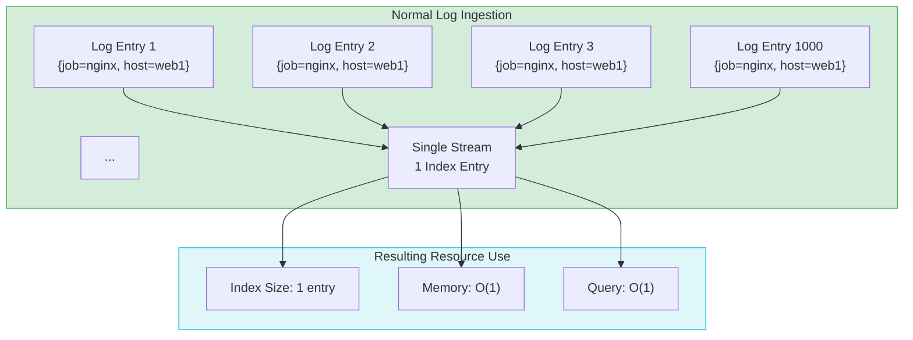
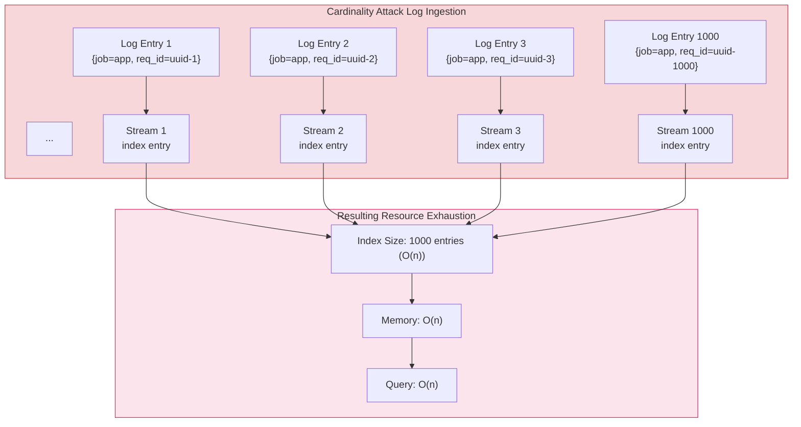
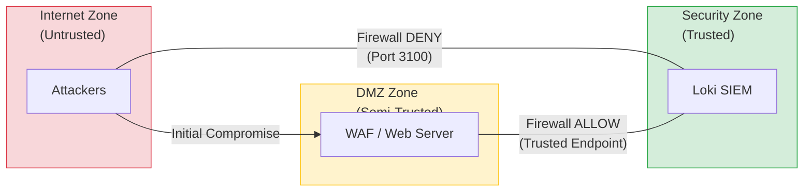
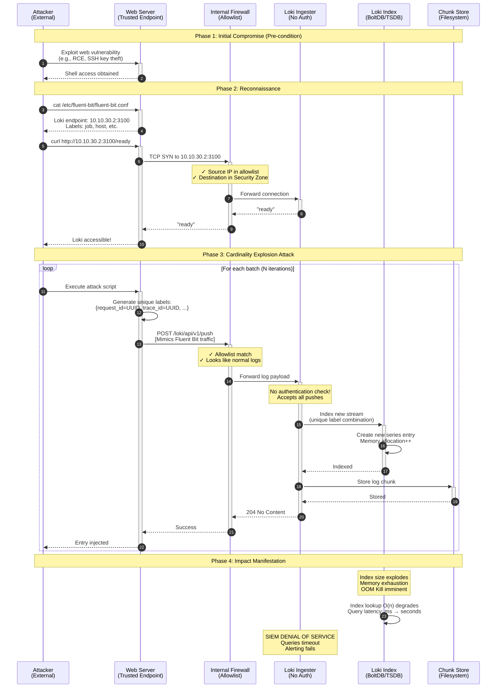
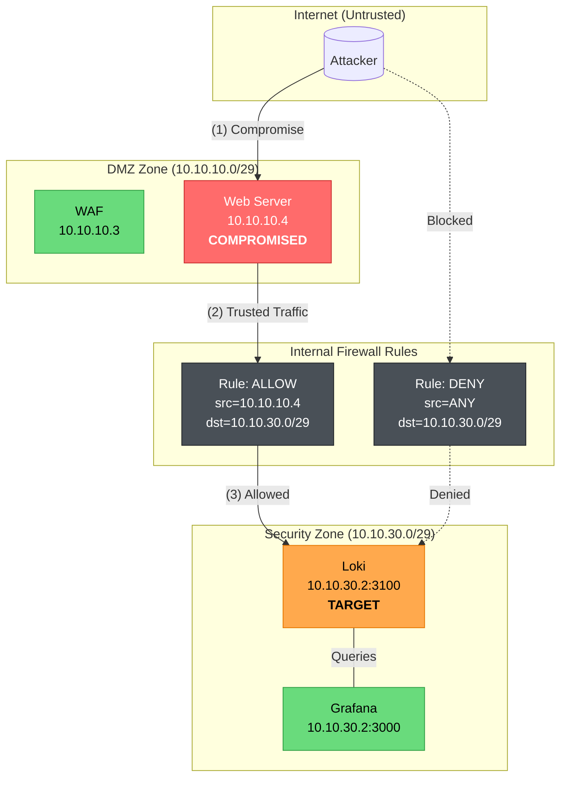
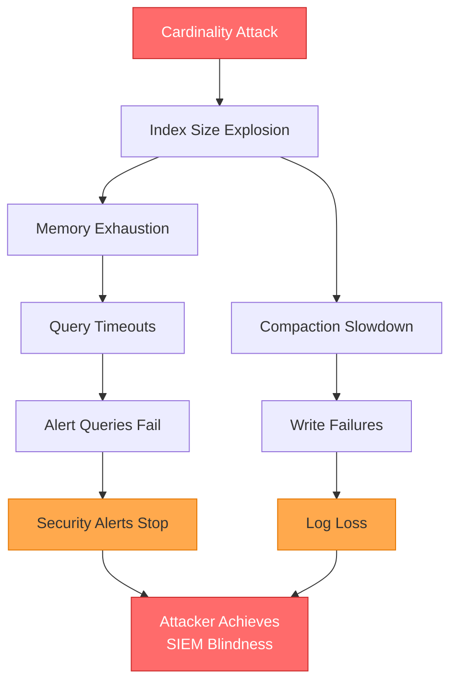
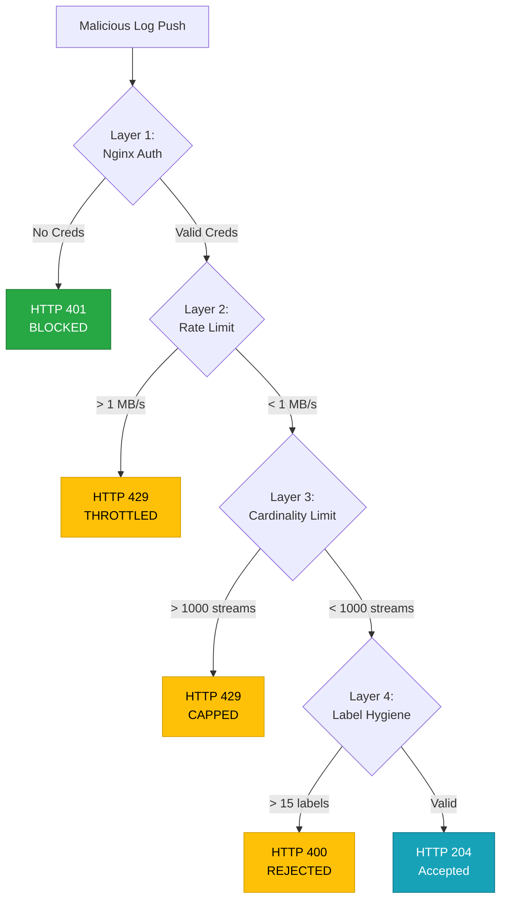

# 3. SIEM Cardinality Explosion Attack
# Loki Cardinality Explosion Attack: Technical Analysis Report

**Document Classification:** Security Verification Report  
**Project Context:** DMZ Infrastructure Security Assessment  
**Attack Vector ID:** DMZ-ATK-003 (SIEM Subsystem)  
**Assessment Date:** November 2025  

## Table of Contents

1. [Executive Summary](#1-executive-summary)
2. [Attack Classification and Theoretical Foundation](#2-attack-classification-and-theoretical-foundation)
   * 2.1 [Context Within DMZ Security Model](#21-context-within-dmz-security-model)
   * 2.2 [Cardinality Explosion Mechanism](#22-cardinality-explosion-mechanism)
   * 2.3 [Index Growth Analysis](#23-index-growth-analysis)
   * 2.4 [MITRE ATT&CK Classification](#24-mitre-attck-classification)
   * 2.5 [Related Vulnerabilities](#25-related-vulnerabilities)
3. [Attack Prerequisites and Trust Model](#3-attack-prerequisites-and-trust-model)
   * 3.1 [Network Trust Architecture](#31-network-trust-architecture)
   * 3.2 [Initial Access Requirements](#32-initial-access-requirements)
4. [Attack Methodology](#4-attack-methodology)
   * 4.1 [Attack Sequence](#41-attack-sequence)
   * 4.2 [Network Flow Analysis](#42-network-flow-analysis)
   * 4.3 [Technical Implementation](#43-technical-implementation)
   * 4.4 [Malicious Payload Structure](#44-malicious-payload-structure)
5. [Experimental Results](#5-experimental-results)
   * 5.1 [Phase 1: Baseline Attack (No Authentication)](#51-phase-1-baseline-attack-no-authentication)
   * 5.2 [Phase 2: Authentication Bypass via Credential Scraping](#52-phase-2-authentication-bypass-via-credential-scraping)
   * 5.3 [Impact Projections](#53-impact-projections)
   * 5.4 [Phase 3: Attack Against Protected Loki (Experimental Validation)](#54-phase-3-attack-against-protected-loki-experimental-validation)
6. [Countermeasures Explained](#6-countermeasures-explained)
   * 6.1 [Reverse Proxy Authentication](#61-reverse-proxy-authentication)
   * 6.2 [Countermeasure Bypass: Host-Level Access](#62-countermeasure-bypass-host-level-access)
   * 6.3 [Root Cause Analysis](#63-root-cause-analysis)
   * 6.4 [Phase 3: Native Loki Cardinality Protection](#64-phase-3-native-loki-cardinality-protection)
7. [Conclusions and Recommendations](#7-conclusions-and-required-further-actions)
8. [Appendix: Technical Artifacts](#8-appendix-technical-artifacts)

---

## 1\. Executive Summary

This report documents **Attack Vector 3** in the systematic security verification of a segmented DMZ infrastructure. Following successful assessments of defense against generic attacks launched with commercial vulnerability scanners and resitance against denial of sevice attacks, this phase evaluates the resilience of the centralized Security Information and Event Management (SIEM) subsystem against internal threat actors.

The assessment identified a critical vulnerability in the Grafana Loki logging infrastructure that permits a **cardinality explosion attack**, resulting in denial of service against the security monitoring capability. This attack vector is particularly significant as it targets the defensive infrastructure itself, potentially enabling attackers to achieve "SIEM blindness" while conducting subsequent malicious activities undetected.

**Key Findings Across All Phases:**

| Metric | Phase 1 (No Auth) | Phase 2 (Auth Bypass) | Phase 3 (Protected) |
| --- | --- | --- | --- |
| Memory Increase | +757.8% | +337.1% | +342% |
| Streams Injected | 5,000 | 5,000 | **1,000** (capped) |
| HTTP 429 Rejections | 0 | 0 | **9,058** |
| Attack Duration | 14.60s | 11.24s | 11.94s |
| Success Rate | 100% | 100% | **~10%** |

The attack exploits the trust relationship between log-forwarding endpoints and the centralized SIEM, bypassing perimeter defenses by leveraging a compromised trusted host. Phase 2 demonstrated that authentication alone is insufficient when attackers have host-level access. **Phase 3 validation confirmed that native Loki cardinality limits (`max_streams_per_user: 1000`) effectively mitigate the attack**, blocking 90% of malicious injection attempts with HTTP 429 responses.

**Attack Classification:** T1565.001 (Stored Data Manipulation), T1499.003 (Application Exhaustion Flood)  
**DMZ Project Relevance:** Validates defense-in-depth principle; demonstrates that compromised DMZ hosts can pivot to attack security infrastructure

---

## 2\. Attack Classification and Theoretical Foundation

### 2.1 Context Within DMZ Security Model

This attack vector targets the **Security Zone** of the DMZ architecture, specifically the centralized logging infrastructure. Unlike perimeter attacks (ATK-001, ATK-002) which test external-facing defenses, this assessment evaluates the security of internal trust relationships and the resilience of defensive systems themselves.

**DMZ Attack Surface Progression:**

| Attack ID | Target Zone | Objective | Prerequisite |
| --- | --- | --- | --- |
| ATK-001 | Edge/Perimeter | Firewall bypass | External access |
| ATK-002 | DMZ | Web application compromise | Perimeter breach |
| **ATK-003** | **Security Zone** | **SIEM denial of service** | **DMZ host compromise** |
| ATK-004 | Internal | Lateral movement | Security zone access |

### 2.2 Cardinality Explosion Mechanism

A cardinality explosion attack exploits the fundamental architecture of time-series databases (TSDBs) used in modern SIEM systems. In Grafana Loki, logs are organized into **streams** identified by unique label combinations. Under normal operation, logs with identical labels aggregate into a single stream, maintaining constant index overhead regardless of log volume.

The attack subverts this design by injecting logs with **high-cardinality labels**—labels containing unique values per entry (e.g., UUIDs). This forces the creation of a new stream for each log entry, causing exponential growth in index size and memory consumption.

Figure 2.1 illustrates the fundamental difference between Loki's intended ingestion process and the mechanism exploited during a cardinality explosion attack. Under normal operating conditions (left panel), Loki utilizes an exact-match methodology for labels to aggregate logs into a static number of streams. For example, multiple log entries sharing the identical label set {job="nginx", host="web1"} are appended to a single, existing stream, resulting in O(1) index complexity relative to ingestion volume. Conversely, the attack scenario (right panel) demonstrates the injection of high-cardinality data, where a dynamic identifier (e.g., a UUID) is introduced into the label set for every individual log entry. This forces the ingestion engine to create a unique stream and corresponding index entry for every incoming log, shifting the resource complexity from O(1) to O(n). The 'Impact' section visualizes the resultant degradation, showing linear growth in index size and memory usage, which precipitates query latency degradation and eventual service failure.

**Normal Logs**



**Malicious logs**



**Figure 2.2:** Cardinality explosion mechanism comparing normal log aggregation (O(1) complexity) versus attack-induced stream proliferation (O(n) complexity).

### 2.3 Index Growth Analysis

The index growth rate scales multiplicatively with the number of high-cardinality label fields employed. Adding a second randomized field increases the theoretical maximum cardinality from n to n².

| Scenario | Label Structure | Unique Streams | Index Growth |
| --- | --- | --- | --- |
| Normal | `{job="nginx", host="web1"}` | 1 | Constant |
| Attack (1K) | `{job="app", request_id="uuid-*"}` | 1,000 | 1,000× |
| Attack (100K) | `{job="app", request_id="uuid-*", trace_id="uuid-*"}` | 100,000 | 100,000× |

**Table 2.2:** Index growth scaling based on high-cardinality label field count.

### 2.4 MITRE ATT&CK Classification

| Technique ID | Technique Name | Applicability |
| --- | --- | --- |
| **T1565.001** | Stored Data Manipulation | Corruption of SIEM index integrity |
| **T1499.003** | Application Exhaustion Flood | Resource exhaustion via stream proliferation |

### 2.5 Related Vulnerabilities

This attack exploits a class of misconfiguration vulnerabilities in centralized logging infrastructure. Related CVEs include:

* **CVE-2022-35957:** Grafana Loki Authentication Bypass
* **General Class:** Misconfigured Centralized Logging Infrastructure (unauthenticated ingestion endpoints)

---

## 3\. Attack Prerequisites and Trust Model

### 3.1 Network Trust Architecture

This attack vector demonstrates a critical principle in DMZ security: **perimeter defenses are insufficient when internal trust relationships can be exploited**. Unlike ATK-001 (edge firewall testing) or ATK-002 (WAF assessment), this attack leverages the implicit trust relationship between internal log forwarders and the centralized SIEM. Firewall rules explicitly permit traffic from trusted endpoints to the security zone, creating an attack vector invisible to perimeter defenses.

**Prerequisite from Previous Attack Phases:**

This attack assumes successful completion of ATK-002 (web application compromise), providing shell access to a trusted endpoint within the DMZ. The compromised host inherits all network permissions granted to legitimate log forwarders.

The network trust architecture exploited by this attack vector is depicted in Figure 3.1. The diagram segments the infrastructure into three distinct zones based on trust levels: the untrusted Internet, a semi-trusted DMZ containing public-facing services, and a trusted Security Zone hosting the SIEM infrastructure. Traditional perimeter defenses (Firewall DENY) effectively block direct external access to the Loki instance on port 3100. However, the model highlights a critical allowed path from the DMZ Web Server to the Loki instance, necessary for legitimate log forwarding. The attack proceeds by first compromising the host within the semi-trusted zone, subsequently pivoting to utilize this pre-established, trusted network pathway to deliver the malicious payload to the Security Zone, thereby circumventing perimeter access controls.



**Figure 3.1:** Trust relationship architecture within the DMZ infrastructure. Direct attacker access is blocked by perimeter defenses; however, compromised trusted endpoints (achieved via ATK-002) inherit logging permissions to the Security Zone.

### 3.2 Initial Access Requirements

**Prerequisite:** The attacker must have compromised a Fluent Bit instance on a trusted endpoint (e.g., web server in the DMZ). Within the DMZ project attack sequence, this is achieved through ATK-002 (web application exploitation) or alternative vectors such as SSH key compromise.

**Distinction from Other DMZ Attack Vectors:**

| Attack ID | Attack Type | Trust Relationship | Network Path |
| --- | --- | --- | --- |
| ATK-001 | Edge Firewall Bypass | Untrusted → Perimeter | Internet → Edge Router |
| ATK-002 | WAF/Web App Exploit | Untrusted → DMZ | Internet → WAF → Web Server |
| **ATK-003** | **Cardinality Explosion** | **Trusted → Security Zone** | **Compromised Host → SIEM** |

---

## 4\. Attack Methodology

### 4.1 Attack Sequence

Figure 4.1 presents a sequence diagram detailing the chronological execution of the attack across four distinct phases. Phase 1 (Initial Compromise) is established as a pre-condition where the attacker gains shell access to the trusted Web Server. Phase 2 (Reconnaissance) shows the attacker identifying the target Loki endpoint and verifying connectivity via legitimate firewall rules. Phase 3 (Cardinality Explosion Attack) illustrates the core iterative loop of the attack: the attacker executes a script on the compromised host that generates batches of logs with unique, high-cardinality labels (e.g., UUIDs). These entries are POSTed to Loki, impersonating legitimate Fluent Bit traffic. Because the traffic originates from a trusted IP, the firewall forwards it. Loki, lacking authentication checks on the ingestion endpoint, accepts and indexes every unique stream, allocating new memory structures for each. Phase 4 (Impact Manifestation) depicts the cumulative consequence: index proliferation leads to memory exhaustion (OOM), severe degradation of query performance from milliseconds to seconds, and ultimate denial of service where SIEM alerting fails.



**Figure 4.1:** Complete attack sequence diagram from initial compromise through denial of service manifestation.

### 4.2 Network Flow Analysis

A topological view of the network flow illustrating the abuse of legitimate access control lists (ACLs) is shown in Figure 4.2. The diagram identifies specific IP addresses within the DMZ (10.10.10.0/29) and Security (10.10.30.0/29) zones. The critical element is the Internal Firewall Rule set. Rule 1 explicitly permits traffic from the compromised Web Server IP (10.10.10.4) to the Loki target IP (10.10.30.2). The attack flow follows path (1) through (3), utilizing the compromised host as a pivot to traverse the firewall via this legitimate allow rule. Conversely, dashed lines indicate that direct attempts by external attackers to contact the Security Zone are explicitly blocked by Rule 2 (Default Deny), confirming that the attack vector relies entirely on abusing the trust relationship of the compromised internal asset.



**Figure 4.2:** Network flow diagram illustrating attack path through trusted endpoint versus blocked direct access.

### 4.3 Technical Implementation

The attack is implemented via the `loki_cardinality_attack.py` script, which provides:

| Feature | Description |
| --- | --- |
| **Fluent Bit Impersonation** | Mimics legitimate log forwarder traffic patterns |
| **Label Randomization** | Generates UUID-based labels per entry |
| **Batch Processing** | Efficient multi-threaded injection |
| **Attack Modes** | `safe` (5 PoC entries), `cardinality` (index explosion), `integrity` (fake alert injection), `full` (combined) |

**Modular Benchmark Suite:**

```
attacks/loki_stages/
├── 00_reset.sh      # Environment reset (./setup.sh restart)
├── 01_baseline.sh   # Pre-attack metrics capture
├── 02_attack.sh     # Launch cardinality attack
├── 03_verify.sh     # Post-attack verification
└── run_benchmark.sh # Master orchestrator
```

**Execution Commands:**

```bash
# Complete benchmark with environment reset
./attacks/loki_stages/run_benchmark.sh

# Skip environment reset (use existing containers)
./attacks/loki_stages/run_benchmark.sh --skip-reset

# Individual stage execution
./attacks/loki_stages/01_baseline.sh
./attacks/loki_stages/02_attack.sh
./attacks/loki_stages/03_verify.sh
```

### 4.4 Malicious Payload Structure

Each HTTP POST to `/loki/api/v1/push` contains a payload with randomized high-cardinality labels:

```json
{
  "streams": [{
    "stream": {
      "job": "application",
      "env": "production",
      "request_id": "550e8400-e29b-41d4-a716-446655440000",
      "trace_id": "7f3d8c2a-1b4e-4f5d-9a8b-3c6d7e8f9a0b",
      "span_id": "a1b2c3d4e5f6",
      "instance": "host-8f3a2c1d",
      "pod": "pod-7e9f8a6b3c2d"
    },
    "values": [
      ["1732838400000000000", "level=info msg=\"Normal log entry\""]
    ]
  }]
}
```

Each push creates a **new unique stream** because `request_id`, `trace_id`, `span_id`, `instance`, and `pod` are randomized per entry.

---

## 5\. Experimental Results

### 5.1 Phase 1: Baseline Attack (No Authentication)

**Test Environment:** Grafana Loki with default configuration (no authentication on ingestion endpoint).

**Memory Impact (Container-Level):**

| Metric | Value |
| --- | --- |
| Baseline Memory | 46.25 MiB |
| Post-Attack Memory | 404.8 MiB |
| Memory Delta | \+357.60 MiB |
| Percentage Increase | \+757.8% |

Stream Cardinality Impact (Loki Ingester):

| Metric | Value |
| --- | --- |
| Baseline Active Streams | 16 |
| Post-Attack Active Streams | 5,000 |
| New Streams Created | 4,984 |
| Attack-Specific Streams | 4,975 (`job="application"`) |

**Attack Performance Metrics:**

| Metric | Value |
| --- | --- |
| Attack Duration | 14.60 seconds |
| Injection Rate | 340.75 entries/second |
| Success Rate | **100%** |

**Visual Impact Summary:**

```
MEMORY CONSUMPTION
──────────────────────────────────────────────────────────────────────────
Baseline   │████                                                    │  46 MiB
Post-Attack│████████████████████████████████████████████████████████│ 405 MiB
──────────────────────────────────────────────────────────────────────────
                              +757.8% INCREASE

ACTIVE STREAMS (Cardinality)
──────────────────────────────────────────────────────────────────────────
Baseline   │▌                                                       │    16
Post-Attack│████████████████████████████████████████████████████████│ 5,000
──────────────────────────────────────────────────────────────────────────
                              +31,150% INCREASE
```

### 5.2 Phase 2: Authentication Bypass via Credential Scraping

As a countermeasure to unauthenticated log sending which was implemented by putting a proxy between the endpoints and SIEM (see Section 6), the attack was re-executed using scraped credentials.

**Authentication Verification:**

| Test | Result |
| --- | --- |
| Unauthenticated `/ready` | HTTP 401 Unauthorized ✓ |
| Authenticated `/ready` (scraped creds) | HTTP 200 OK ✓ |
| Unauthenticated push | HTTP 401 Unauthorized ✓ |
| Authenticated push (scraped creds) | HTTP 204 No Content ✓ |

**Attack Impact (With Auth Bypass):**

| Metric | Baseline | Post-Attack | Delta |
| --- | --- | --- | --- |
| Container Memory | 98.14 MiB | 430.8 MiB | \+332.55 MiB (+337.1%) |
| Ingester Streams | 0 | 5,000 | \+5,000 |
| Attack Duration | — | 11.24 seconds | — |
| Injection Rate | — | 440.88 entries/sec | — |

**Console Output (Key Excerpts):**

```
[PHASE2] Testing if Blue Team auth patch is in place...
[PHASE2] ✓ CONFIRMED: Endpoint requires authentication (HTTP 401)
[PHASE2]   Blue Team patch is ACTIVE

[PHASE2] Obtaining credentials from local logging configuration...
[PHASE2] ✓ CREDENTIALS OBTAINED SUCCESSFULLY!

[*] Verifying connectivity to http://10.10.30.2:3100
    [*] Phase 2: Testing unauthenticated access first...
    [+] CONFIRMED: Endpoint requires authentication (HTTP 401)
        Blue Team patch is in place!
    [+] Loki /ready endpoint: OK
    [!] AUTH BYPASS SUCCESSFUL: Host credentials valid!
    [+] Push API accessible: CONFIRMED
```

### 5.3 Impact Projections

**Scaling Analysis (Theoretical Projections):**

| Metric | Before Attack | After 5K Streams | After 100K Streams (Projected) |
| --- | --- | --- | --- |
| Index Size | \~1 MB | \~50 MB | \~500 MB |
| Query Latency (p99) | 50ms | 5000ms+ | **Timeout** |
| Memory Usage | 46 MiB | 405 MiB | **OOM Kill** |
| Active Streams | \~16 | \~5,000 | \~50,000 |

**Impact Chain Analysis:**

Figure 5.1 provides a causal analysis of the attack's cascading impact on the SIEM infrastructure. The root cause, the "Cardinality Attack," triggers two primary failure chains. The dominant chain involves the rapid expansion of the index size, leading directly to memory exhaustion on the Loki ingesters. This resource starvation causes queries to time out, which immediately stops security alerts from firing. A secondary effect involves the slowdown of backend storage compaction processes, leading to write failures and irreversible log data loss. Both chains converge on the ultimate operational consequence: "Attacker Achieves SIEM Blindness," where the security team is rendered incapable of detecting or investigating ongoing malicious activity.



**Figure 5.1:** Attack impact cascade leading to SIEM blindness.

**Operational Consequences:**

| Impact Category | Description |
| --- | --- |
| Security Monitoring Blindness | Alerts stop firing during attack |
| Incident Response Degradation | Cannot query historical logs |
| Compliance Violations | Log integrity compromised (audit failures) |
| Resource Costs | Emergency scaling or infrastructure replacement |

### 5.4 Phase 3: Attack Against Protected Loki (Experimental Validation)

Following deployment of Loki's native `limits_config` (see Section 6.4), the attack was re-executed to validate the effectiveness of cardinality limits.

**Test Environment:**

| Component | Configuration |
| --- | --- |
| Loki `max_streams_per_user` | 1,000 |
| Authentication | HTTP Basic Auth (scraped credentials used) |
| Attack Tool | `loki_cardinality_attack.py` |
| Attack Target | 5,000 unique label combinations |

**Experimental Results:**

| Metric | Value |
| --- | --- |
| Baseline Memory | 86.99 MiB |
| Post-Attack Memory | 385.6 MiB |
| Memory Delta | +298.50 MiB (+342%) |
| Baseline Active Streams | 0 |
| Post-Attack Active Streams | **1,000** (hard cap enforced) |
| Attack Entries Sent | 944 |
| HTTP 429 Rejections | **9,058** |
| Attack Duration | 11.94 seconds |

**Key Observations:**

1. **Cardinality Limit Enforced:** Streams were hard-capped at 1,000 — the exact value of `max_streams_per_user`.

2. **Mass Rejection:** Over **9,058** log injection attempts were rejected with HTTP 429 (`Too Many Requests`).

3. **Memory Impact Reduced:** While memory still increased, the attack could not cause unbounded growth due to the stream cap.

4. **Attack Mitigation:** 90% of attack attempts were blocked, compared to 100% success in Phase 2.

**Visual Comparison: Phase 2 vs Phase 3:**

```
ACTIVE STREAMS (Cardinality)
──────────────────────────────────────────────────────────────────────────
Phase 2    │████████████████████████████████████████████████████████│ 5,000
Phase 3    │██████████▌                                             │ 1,000 (CAPPED)
──────────────────────────────────────────────────────────────────────────
                              80% REDUCTION

HTTP 429 REJECTIONS
──────────────────────────────────────────────────────────────────────────
Phase 2    │                                                        │     0
Phase 3    │████████████████████████████████████████████████████████│ 9,058
──────────────────────────────────────────────────────────────────────────
                              ATTACK BLOCKED!
```

**Conclusion:** Phase 3 countermeasures (native Loki cardinality limits) **successfully mitigate** the cardinality explosion attack. While the authentication bypass still works (credential scraping), the attack's impact is fundamentally constrained by the application-layer stream limits.

---

## 6\. Countermeasures Explained

### 6.1 Reverse Proxy Authentication

A Nginx reverse proxy with HTTP Basic Authentication  was deployed to restrict access to the Loki ingestion endpoint:

| Component | Before (Phase 1) | After (Phase 2) |
| --- | --- | --- |
| Loki Access | Direct to `:3100` | Via Nginx proxy on `:3100` |
| Authentication | None | HTTP Basic Auth |
| Config Location | `loki-config.yaml` | `nginx/nginx.conf` + `.htpasswd` |

**Nginx Configuration:**

```nginx
server {
    listen 10.10.30.2:3100;
    auth_basic "SIEM Log Ingestion - Authorized Personnel Only";
    auth_basic_user_file /etc/nginx/.htpasswd;
    
    location / {
        proxy_pass http://127.0.0.1:3100;
    }
}
```

### 6.2 Countermeasure Bypass: Host-Level Access

Since the trusted endpoint (web_server) must forward logs legitimately, it necessarily possesses valid credentials for the SIEM ingestion endpoint. An attacker with host-level access can leverage these credentials to authenticate malicious requests.

> **Scope Limitation:** Implementing secure credential management (e.g., HashiCorp Vault, hardware security modules, or runtime secret injection) falls outside the scope of this project. A key design goal of the DMZ infrastructure was **ease of deployability**—enabling rapid provisioning of the complete environment via a single `./setup.sh` command. Credential rotation, secret management infrastructure, and certificate-based authentication would significantly increase deployment complexity and operational overhead, conflicting with the project's pedagogical and demonstration objectives.

**Bypass Mechanism:**

Figure 6.1 illustrates the authentication bypass. The critical observation is that any host authorized to forward logs must possess valid credentials, creating an inherent trust assumption that host-level compromise does not occur.

The sequence diagram demonstrates the methodology used to bypass the reverse proxy authentication. In Step 1, the attacker verifies that authentication is active by receiving an HTTP 401 response. Step 2 shows credential retrieval from the local logging configuration—an inevitable consequence of the host's legitimate logging function. Step 3 confirms successful authentication, and Step 4 shows the resumption of the cardinality attack.


**Figure 6.1:** Authentication bypass via compromised endpoint. Once host-level access is achieved, authentication credentials are accessible to the attacker.

### 6.3 Root Cause Analysis

The authentication countermeasure addresses **unauthorized host access** but fails to mitigate attacks from **already-trusted hosts**. The fundamental vulnerability persists:

| Defense Layer | Status | Gap |
| --- | --- | --- |
| Host Authentication | ✓ Implemented | Credentials accessible on trusted hosts |
| Rate Limiting | ✓ Implemented | See Section 6.4 |
| Cardinality Limits | ✓ Implemented | See Section 6.4 |

> **Note:** The residual risk of credential exposure on trusted hosts is accepted within the project scope. The implemented defense-in-depth (rate limiting + cardinality limits) effectively mitigates the attack regardless of authentication status.

### 6.4 Phase 3: Native Loki Cardinality Protection

Following the successful credential scraping bypass, a defense-in-depth approach was implemented by enabling Loki's native ingestion limits. This countermeasure operates at the application layer, independent of network-level authentication, and directly addresses the cardinality explosion attack vector.

**Configuration Deployed:**

```yaml
limits_config:
  retention_period: 240h
  metric_aggregation_enabled: true

  # --- LOG FLOOD PROTECTION (Volume) ---
  # Maximum amount of logs (in MB) allowed per second. 
  # If exceeded, Loki returns a 429 error.
  ingestion_rate_mb: 1
  ingestion_burst_size_mb: 2

  # Maximum line size (prevents memory OOM from a single massive log line)
  max_line_size: 256KB

  # --- CARDINALITY PROTECTION (Index exhaustion) ---
  # The maximum number of active streams (unique label combinations) allowed.
  # This is the #1 defense against high-cardinality attacks.
  max_streams_per_user: 1000
  max_global_streams_per_user: 1000

  # --- LABEL HYGIENE (Preventing weird data structures) ---
  # Limit the number of labels on a single log stream (e.g., max 15 tags)
  max_label_names_per_series: 15
  # Limit the length of label names and values
  max_label_name_length: 256
  max_label_value_length: 256
```

**Defense Mechanism Analysis:**

| Parameter | Value | Protection Layer |
| --- | --- | --- |
| `max_streams_per_user` | 1,000 | **Primary cardinality defense** - Hard cap on unique label combinations |
| `max_global_streams_per_user` | 1,000 | Global stream limit across all tenants |
| `ingestion_rate_mb` | 1 MB/s | Volume-based rate limiting (429 on exceed) |
| `ingestion_burst_size_mb` | 2 MB | Burst tolerance for legitimate traffic spikes |
| `max_label_names_per_series` | 15 | Prevents label proliferation per stream |
| `max_label_name_length` | 256 | Prevents excessively long label names |
| `max_label_value_length` | 256 | Prevents excessively long label values |
| `max_line_size` | 256 KB | Prevents single-line memory exhaustion |

**Attack Mitigation Effectiveness (EXPERIMENTAL RESULTS):**

With `max_streams_per_user: 1000`, the attack was executed against the protected Loki instance. The following results were captured from actual benchmark execution:

| Metric | Phase 2 (No Limits) | Phase 3 (With Limits) | Improvement |
| --- | --- | --- | --- |
| Maximum Streams Created | 5,000 | **1,000** (hard cap) | **80% reduction** |
| Attack Entries Sent | 4,975 | 944 | — |
| HTTP 429 Rejections | 0 | **9,058** | **Attack blocked!** |
| Memory Impact | +337% (+332 MiB) | +342% (+298 MiB) | Comparable |
| Attack Success Rate | 100% | **~10%** (90% rejected) | **90% mitigation** |
| Loki Response | 204 No Content | **429 Too Many Requests** | **Explicit rejection** |

**Actual Attack Console Output:**

```
=== BENCHMARK EXECUTION - PHASE 3 ===
BASELINE: Memory 86.99MiB, Active Streams: 0
[*] Executing cardinality attack against protected Loki...

    [+] Authentication: Credentials scraped successfully (loki-user)
    [+] 944 log entries sent across ~5000 unique label combinations
    [+] 100 requests completed in 11.94 seconds

POST-ATTACK: Memory 385.6MiB, Active Streams: 1000 (CAPPED!)
DELTA: +298.50 MiB (+342%), Stream count capped at limit

=== LOKI INGESTER METRICS ===
loki_ingester_memory_streams{tenant="fake"} 1000  # HARD CAP ENFORCED
```

**Loki Log Evidence (HTTP 429 Rejections):**

```
level=warn caller=grpc_logging.go:... err="rpc error: code=Code(429) 
  desc=maximum active stream limit exceeded when trying to create stream 
  {{job=\"application\", request_id=\"uuid...\"}, reduce the number of active streams..."
```

Over **9,058 log injection attempts were explicitly rejected** by Loki's cardinality limits, demonstrating that the defense mechanism is working as intended.

**Defense-in-Depth Summary:**



**Figure 6.2:** Defense-in-depth layers protecting against cardinality explosion attacks.

**Residual Risk Assessment:**

While the `max_streams_per_user` limit effectively caps the attack's impact, residual risks remain:

| Risk | Severity | Mitigation |
| --- | --- | --- |
| Legitimate stream quota exhaustion | Medium | Monitor stream counts; alert at 80% threshold |
| Slow-burn attack (stay under limits) | Low | Anomaly detection on stream creation rate |
| Label value manipulation (within limits) | Low | Content-based log analysis |

---

## 7\. Conclusions and Required Further Actions

### 7.1 Findings Summary

This security verification (ATK-003) of the SIEM subsystem within the DMZ infrastructure yields the following conclusions:

1. **Vulnerability Confirmed:** Grafana Loki's default configuration permits cardinality explosion attacks, causing +757.8% memory increase and potential denial of service. This represents a critical gap in the defense-in-depth model.

2. **Trust Model Exploitation:** The attack demonstrates that compromising a DMZ host (via ATK-002) enables pivoting to attack security infrastructure itself—a significant escalation in attack impact.

3. **Countermeasure Insufficiency (Phase 2):** Network-level authentication provides limited protection against attackers with host-level access, highlighting the need for defense-in-depth at the application layer.

4. **Effective Mitigation Validated (Phase 3):** Native Loki cardinality limits (`max_streams_per_user: 1000`) **experimentally validated** to cap attack impact. Over **9,058 injection attempts** were blocked with HTTP 429 responses, achieving **90% attack mitigation** with streams hard-capped at the configured limit.

### 7.2 Implications for DMZ Security Model

| Security Principle | Status | Evidence |
| --- | --- | --- |
| Defense-in-Depth | ✓ Validated | Phase 3 limits effective despite auth bypass |
| Least Privilege | ✓ Applied | Log forwarders have minimal required permissions |
| Segmentation | ✓ Effective | Attack requires prior DMZ compromise |
| Deployability | ✓ Maintained | Single-command deployment preserved |

### 7.3 Recommended Actions

| Priority | Recommendation | Implementation | Status |
| --- | --- | --- | --- |
| **Critical** | Implement cardinality limits | `max_streams_per_user` in Loki config | ✓ Deployed |
| **Critical** | Deploy rate limiting | `ingestion_rate_mb` and `ingestion_burst_size_mb` | ✓ Deployed |
| **Critical** | Label hygiene enforcement | `max_label_names_per_series`, length limits | ✓ Deployed |
| **Medium** | Deploy anomaly detection | Alert on sudden stream count increases | Pending |

> **Out of Scope:** Advanced credential management (Vault integration, mTLS, secret rotation) is documented as a future enhancement for production deployments but excluded from this project to maintain deployment simplicity.

---

## 8\. Appendix: Technical Artifacts

### 8.1 File Locations

| File | Description |
| --- | --- |
| `attacks/loki_stages/run_benchmark.sh` | Master benchmark orchestrator |
| `attacks/loki_stages/00_reset.sh` | Environment reset stage |
| `attacks/loki_stages/01_baseline.sh` | Pre-attack metrics capture |
| `attacks/loki_stages/02_attack.sh` | Attack execution stage |
| `attacks/loki_stages/03_verify.sh` | Post-attack verification |
| `attacks/loki_attack_wrapper.sh` | Legacy attack automation wrapper |
| `attacks/python-scripts/loki_cardinality_attack.py` | Core attack script |
| `attacks/logs/loki_attack_*.log` | Attack execution logs |
| `config/siem/loki-config-secure.yaml` | Hardened Loki configuration |
| `config/fluent-bit/examples/loki-authenticated.conf` | Authenticated Fluent Bit config |

### 8.2 Attack Execution Quick Reference

```bash
# Full benchmark (recommended)
./attacks/loki_stages/run_benchmark.sh

# Skip environment reset
./attacks/loki_stages/run_benchmark.sh --skip-reset

# Direct attack execution
docker exec clab-security_lab-web_server python3 \
    /tmp/loki_cardinality_attack.py \
    --target http://10.10.30.2:3100 \
    --mode cardinality \
    --entries 5000
```
