# Loki Cardinality Explosion Attack - Red Team Documentation

## Executive Summary

This document details the **Loki Cardinality Explosion Attack** - an infrastructure-layer attack targeting the unauthenticated Grafana Loki SIEM instance in the SichereDMZ lab. Unlike application-layer attacks (WAF stress tests), this attack exploits the **trust relationship** between internal log forwarders and the centralized logging infrastructure.

### Attack Classification

| Attribute | Value |
|-----------|-------|
| **Attack Type** | Infrastructure / SIEM Denial of Service |
| **Vector** | Compromised Trusted Endpoint (Fluent Bit Agent) |
| **Target** | Grafana Loki Push API (Unauthenticated) |
| **Impact** | Index explosion, storage exhaustion, query DoS |
| **MITRE ATT&CK** | T1565.001 (Stored Data Manipulation), T1499.003 (Application Exhaustion Flood) |

---

## Table of Contents

1. [Vulnerability Analysis](#vulnerability-analysis)
2. [Attack Flow Diagram](#attack-flow-diagram)
3. [High Cardinality Explained](#high-cardinality-explained)
4. [Technical Implementation](#technical-implementation)
5. [Usage Guide](#usage-guide)
6. [Impact Analysis](#impact-analysis)
7. [Detection Strategies](#detection-strategies)
8. [Remediation](#remediation)
9. [Legal Disclaimer](#legal-disclaimer)

---

## Vulnerability Analysis

### The Trust Model Flaw

The SichereDMZ lab implements network-level segmentation to protect the SIEM:

```
┌─────────────────┐     ┌─────────────────┐     ┌─────────────────┐
│   Internet      │──X──│   DMZ Zone      │──X──│  Security Zone  │
│   (Attackers)   │     │   (Web/WAF)     │     │    (Loki)       │
└─────────────────┘     └─────────────────┘     └─────────────────┘
        │                       │                       │
        │   Firewall DENY       │   Firewall ALLOW      │
        │   (Port 3100)         │   (Trusted Endpoint)  │
        └───────────────────────┴───────────────────────┘
```

**The vulnerability:** Once an attacker compromises a "trusted" log forwarder (web_server), they inherit the firewall allowlist permissions. Loki has **no application-layer authentication**, relying entirely on network isolation.

### Affected Component

| Component | Version | Issue |
|-----------|---------|-------|
| Grafana Loki | 2.x | `auth_enabled: false` (default) |
| Fluent Bit | 2.x | No Tenant_ID authentication configured |

### CVE Reference

While not a CVE itself, this misconfiguration enables attacks similar to:
- **CVE-2022-35957**: Grafana Loki Authentication Bypass
- General class: "Misconfigured Centralized Logging Infrastructure"

---

## Attack Flow Diagram

### Primary Attack Sequence


### Network Flow Architecture

```mermaid
flowchart TB
    subgraph INTERNET["🌐 Internet (Untrusted)"]
        ATK[("👤 Attacker")]
    end
    
    subgraph DMZ["🔶 DMZ Zone (10.10.10.0/29)"]
        WAF["🛡️ WAF<br/>10.10.10.3"]
        WEB["🌐 Web Server<br/>10.10.10.4<br/><b>COMPROMISED</b>"]
    end
    
    subgraph SECURITY["🔒 Security Zone (10.10.30.0/29)"]
        LOKI["📊 Loki<br/>10.10.30.2:3100<br/><b>TARGET</b>"]
        SIEM["📈 Grafana<br/>10.10.30.2:3000"]
    end
    
    subgraph INTERNAL_FW["🧱 Internal Firewall Rules"]
        RULE1["Rule: ALLOW<br/>src=10.10.10.4 (webserver)<br/>dst=10.10.30.0/29<br/>port=3100/tcp"]
        RULE2["Rule: DENY<br/>src=ANY<br/>dst=10.10.30.0/29<br/>port=3100/tcp"]
    end
    
    ATK -->|"1️⃣ Compromise"| WEB
    WEB -->|"2️⃣ Trusted Traffic"| RULE1
    RULE1 -->|"3️⃣ Allowed"| LOKI
    ATK -.->|"❌ Blocked"| RULE2
    RULE2 -.->|"❌ Denied"| LOKI
    
    LOKI <-->|"Queries"| SIEM
    
    classDef compromised fill:#ff6b6b,stroke:#c92a2a,color:white
    classDef target fill:#ffa94d,stroke:#e67700,color:black
    classDef firewall fill:#495057,stroke:#212529,color:white
    classDef normal fill:#69db7c,stroke:#2f9e44,color:black
    
    class WEB compromised
    class LOKI target
    class RULE1,RULE2 firewall
    class WAF,SIEM normal
```



### Cardinality Explosion Mechanism


---

## High Cardinality Explained

### What is Cardinality?

In time-series databases like Loki, **cardinality** refers to the number of unique combinations of label values. Each unique combination creates a separate "stream" that must be indexed.

### The Mathematics of Destruction

| Scenario | Label Structure | Unique Streams | Index Growth |
|----------|----------------|----------------|--------------|
| **Normal** | `{job="nginx", host="web1"}` | 1 | Constant |
| **Attack (1K)** | `{job="app", request_id="uuid-*"}` | 1,000 | 1,000x |
| **Attack (100K)** | `{job="app", request_id="uuid-*", trace_id="uuid-*"}` | 100,000 | 100,000x |

### Why This Crashes Loki

```
┌─────────────────────────────────────────────────────────────────┐
│                    LOKI STORAGE MODEL                           │
├─────────────────────────────────────────────────────────────────┤
│                                                                 │
│   ┌─────────────┐         ┌─────────────────────────────────┐   │
│   │   INDEX     │         │        CHUNK STORE              │   │
│   │  (BoltDB)   │         │       (Filesystem)              │   │
│   ├─────────────┤         ├─────────────────────────────────┤   │
│   │ Stream 1 ──────────── │ Chunk: [timestamp, log line]    │   │
│   │ Stream 2 ──────────── │ Chunk: [timestamp, log line]    │   │
│   │ Stream 3 ──────────── │ Chunk: [timestamp, log line]    │   │
│   │   ...       │         │   ...                           │   │
│   │ Stream N ──────────── │ Chunk: [timestamp, log line]    │   │
│   └─────────────┘         └─────────────────────────────────┘   │
│         │                                                       │
│         ▼                                                       │
│   ┌─────────────────────────────────────────────────────────┐   │
│   │              MEMORY CONSUMPTION                         │   │
│   ├─────────────────────────────────────────────────────────┤   │
│   │  Index entries:     O(cardinality)                      │   │
│   │  Query performance: O(cardinality) for label scans      │   │
│   │  Memory footprint:  ~1KB per active stream              │   │
│   │                                                         │   │
│   │  ATTACK IMPACT:                                         │   │
│   │  - 100,000 streams = ~100MB index overhead              │   │
│   │  - Query latency: ms → seconds → timeout                │   │
│   │  - OOM kill threshold reached                           │   │
│   └─────────────────────────────────────────────────────────┘   │
│                                                                 │
└─────────────────────────────────────────────────────────────────┘
```

**Key insight:** The *index size* grows with cardinality, while *chunk storage* grows with data volume. An attacker can exhaust memory and CPU with minimal data by maximizing unique label combinations.

---

## Technical Implementation

### Attack Script Overview

The `loki_cardinality_attack.py` script implements:

1. **Fluent Bit Impersonation**: Mimics legitimate log forwarder traffic
2. **Label Randomization**: Generates UUID-based labels per entry
3. **Batch Processing**: Efficient multi-threaded injection
4. **Attack Modes**:
   - `safe`: 5 PoC entries (proof of access)
   - `cardinality`: Index explosion attack
   - `integrity`: Fake security alert injection
   - `full`: Combined attack

### Sample Malicious Payload

```json
{
  "streams": [{
    "stream": {
      "job": "application",
      "env": "production",
      "request_id": "550e8400-e29b-41d4-a716-446655440000",
      "trace_id": "7f3d8c2a-1b4e-4f5d-9a8b-3c6d7e8f9a0b",
      "span_id": "a1b2c3d4e5f6",
      "instance": "host-8f3a2c1d",
      "pod": "pod-7e9f8a6b3c2d"
    },
    "values": [
      ["1732838400000000000", "level=info msg=\"Normal log entry\""]
    ]
  }]
}
```

Each push creates a **new unique stream** because `request_id`, `trace_id`, etc. are randomized.

---

## Usage Guide

### Modular Benchmark Suite

The attack is implemented as a modular benchmark suite with numbered stages for reproducibility:

```
attacks/loki_stages/
├── 00_reset.sh      # Environment reset (./setup.sh restart)
├── 01_baseline.sh   # Pre-attack metrics capture
├── 02_attack.sh     # Launch cardinality attack
├── 03_verify.sh     # Post-attack verification
└── run_benchmark.sh # Master orchestrator
```

### Full Benchmark Execution

```bash
# Execute complete benchmark with environment reset
./attacks/loki_stages/run_benchmark.sh

# Skip environment reset (use existing containers)
./attacks/loki_stages/run_benchmark.sh --skip-reset

# Run individual stages manually
./attacks/loki_stages/01_baseline.sh
./attacks/loki_stages/02_attack.sh
./attacks/loki_stages/03_verify.sh
```

### Legacy Wrapper Script

For interactive use, the wrapper script is still available:

```bash
# Copy attack script to trusted endpoint
docker cp /home/david/SichereDMZ/attacks/python-scripts/loki_cardinality_attack.py \
    clab-security_lab-web_server:/tmp/

# Copy wrapper script
docker cp /home/david/SichereDMZ/attacks/loki_attack_wrapper.sh \
    clab-security_lab-web_server:/tmp/

# Enter trusted endpoint
docker exec -it clab-security_lab-web_server /bin/bash

# Safe mode (connectivity verification)
/tmp/loki_attack_wrapper.sh -m safe

# Execute cardinality attack (DESTRUCTIVE)
/tmp/loki_attack_wrapper.sh -m cardinality -n 10000
```

### Command-Line Options (Wrapper Script)

| Option | Description | Default |
|--------|-------------|---------|
| `-m, --mode` | Attack mode (safe/cardinality/integrity/full) | safe |
| `-n, --entries` | Number of log entries to inject | 1000 |
| `-t, --threads` | Parallel injection threads | 4 |
| `-u, --unique` | Unique label sets per batch | 50 |
| `--dry-run` | Preview command without execution | false |
| `--verify-only` | Only test connectivity | false |
| `--skip-verify` | Bypass trusted endpoint check | false |

---

## Impact Analysis

### Empirical Benchmark Results

The following data was captured from a live benchmark run against a freshly deployed SIEM environment:

#### Test Configuration

| Parameter | Value |
|-----------|-------|
| Attack Mode | cardinality |
| Total Entries | 10,000 |
| Threads | 50 |
| Unique Streams/Batch | 100 |
| Target | 10.10.30.2:3100 |
| Trusted Endpoint | clab-security_lab-web_server |

#### Memory Impact (Container-Level)

| Metric | Value |
|--------|-------|
| **Baseline Memory** | 46.25 MiB |
| **Post-Attack Memory** | 404.8 MiB |
| **Memory Delta** | +357.60 MiB |
| **Percentage Increase** | **+757.8%** |

#### Stream Cardinality Impact (Loki Ingester)

| Metric | Value |
|--------|-------|
| **Baseline Active Streams** | 16 |
| **Post-Attack Active Streams** | 5,000 |
| **New Streams Created** | 4,984 |
| **Attack-Specific Streams** | 4,975 (job="application") |

#### Attack Performance Metrics

| Metric | Value |
|--------|-------|
| **Attack Duration** | 14.60 seconds |
| **Injection Rate** | 340.75 entries/second |
| **Success Rate** | 100% |

### Visual Impact Summary

```
MEMORY CONSUMPTION
──────────────────────────────────────────────────────────────────────────
Baseline   │████                                                    │  46 MiB
Post-Attack│████████████████████████████████████████████████████████│ 405 MiB
──────────────────────────────────────────────────────────────────────────
                              +757.8% INCREASE

ACTIVE STREAMS (Cardinality)
──────────────────────────────────────────────────────────────────────────
Baseline   │▌                                                       │    16
Post-Attack│████████████████████████████████████████████████████████│ 5,000
──────────────────────────────────────────────────────────────────────────
                              +31,150% INCREASE
```

### Immediate Effects (Theoretical Projections)

| Metric | Before Attack | After Attack (10K streams) | After 100K streams (projected) |
|--------|---------------|---------------------------|--------------------------------|
| Index Size | ~1 MB | ~50 MB | ~500 MB |
| Query Latency (p99) | 50ms | 5000ms+ | Timeout |
| Memory Usage | 46 MiB | 405 MiB | OOM Kill |
| Active Streams | ~16 | ~5,000 | ~50,000 |

### Cascading Failures

```mermaid
flowchart TD
    A["🔴 Cardinality Attack"] --> B["📈 Index Size Explosion"]
    B --> C["💾 Memory Exhaustion"]
    C --> D["⏱️ Query Timeouts"]
    D --> E["🚨 Alert Queries Fail"]
    E --> F["🔕 Security Alerts Stop"]
    
    B --> G["🐌 Compaction Slowdown"]
    G --> H["💥 Write Failures"]
    H --> I["📉 Log Loss"]
    
    F --> J["🎯 Attacker Achieves<br/>SIEM Blindness"]
    I --> J
    
    style A fill:#ff6b6b,stroke:#c92a2a,color:white
    style J fill:#ff6b6b,stroke:#c92a2a,color:white
    style F fill:#ffa94d,stroke:#e67700
    style I fill:#ffa94d,stroke:#e67700
```



### Business Impact

1. **Security Monitoring Blindness**: Alerts stop firing during attack
2. **Incident Response Degradation**: Cannot query historical logs
3. **Compliance Violations**: Log integrity compromised (audit failures)
4. **Resource Costs**: Emergency scaling or infrastructure replacement

---

## Detection Strategies

### Loki Metrics to Monitor

```promql
# Stream count explosion
increase(loki_ingester_streams_created_total[5m]) > 1000

# Memory pressure
loki_ingester_memory_streams > 10000

# Chunk flush failures
rate(loki_ingester_chunk_stored_total{result="err"}[5m]) > 0

# Query latency degradation
histogram_quantile(0.99, rate(loki_request_duration_seconds_bucket[5m])) > 5
```

### Log-Based Detection

```logql
# Unusual label cardinality
{job=~".+"} | label_format high_card=`{{.request_id}}{{.trace_id}}` 
| line_format "{{.high_card}}" 
| count_over_time [1m] > 100

# Push requests from unexpected sources
{job="nginx"} |= "POST /loki/api/v1/push" | json | source_ip != "expected_forwarder_ip"
```

### Network-Based Detection

```bash
# Unusual traffic volume to Loki port
tcpdump -i eth0 port 3100 -c 1000 | wc -l  # Baseline vs. current
```

---

## Remediation

### Immediate Actions

1. **Enable Authentication**:
   ```yaml
   # loki-config.yaml
   auth_enabled: true
   ```

2. **Configure Stream Limits**:
   ```yaml
   limits_config:
     max_streams_per_user: 10000
     max_global_streams_per_user: 50000
     ingestion_rate_mb: 10
     ingestion_burst_size_mb: 20
   ```

3. **Bind to Internal Interface**:
   ```yaml
   server:
     http_listen_address: 127.0.0.1  # or internal VLAN IP
   ```

### Fluent Bit Hardening

```ini
# fluent-bit.conf
[OUTPUT]
    Name        loki
    Match       *
    Host        loki.internal
    Port        3100
    Tenant_ID   ${LOKI_TENANT_ID}   # Require tenant authentication
    Labels      job=fluentbit, host=${HOSTNAME}
    # Do NOT include dynamic labels like request_id
```

### Network Hardening

```bash
# nftables rule: Rate limit Loki push API
nft add rule inet filter forward \
    ip saddr 10.10.10.0/29 \
    tcp dport 3100 \
    limit rate 100/second burst 500 packets \
    accept
```

---

## Phase 2: Authentication Bypass & Persistence

### Executive Summary

After our initial Phase 1 findings, the Blue Team deployed a remediation: an **Nginx reverse proxy** enforcing **HTTP Basic Authentication** in front of Loki. This section documents how we bypassed this control by **scraping credentials from the compromised trusted endpoint**.

### Blue Team Patch Analysis

| Component | Before (Phase 1) | After (Phase 2) |
|-----------|------------------|-----------------|
| **Loki Access** | Direct to `:3100` | Via Nginx proxy on `:3100` |
| **Authentication** | None | HTTP Basic Auth |
| **Config Location** | `loki-config.yaml` | `nginx/nginx.conf` + `.htpasswd` |

**Nginx Configuration (deployed by Blue Team):**
```nginx
server {
    listen 10.10.30.2:3100;
    auth_basic "SIEM Log Ingestion - Authorized Personnel Only";
    auth_basic_user_file /etc/nginx/.htpasswd;
    
    location / {
        proxy_pass http://127.0.0.1:3100;
    }
}
```

### Phase 2 Attack Vector: Credential Scraping

Since the trusted endpoint (`web_server`) still needs to forward logs, its **Fluent Bit configuration must contain valid credentials**:

```ini
# /etc/fluent-bit/pipelines/ssh-logs.conf (on web_server)
[OUTPUT]
    Name             loki
    Host             10.10.30.2
    Port             3100
    http_user        loki-user           # ← SCRAPED
    http_passwd      a_secretPW#15secEt  # ← SCRAPED
```

### Phase 2 Attack Flow

```mermaid
sequenceDiagram
    participant ATK as 🔴 Attacker
    participant WEB as 🟢 Web Server<br/>(Compromised)
    participant PROXY as 🧱 Nginx Proxy<br/>(Auth Enforced)
    participant LOKI as 📊 Loki Backend
    
    Note over ATK,LOKI: Step 1: Verify Auth Enforcement
    ATK->>WEB: Test unauthenticated access
    WEB->>PROXY: GET /ready (no creds)
    PROXY-->>WEB: HTTP 401 Unauthorized
    WEB-->>ATK: ✓ Auth patch confirmed active
    
    Note over ATK,LOKI: Step 2: Credential Scraping
    ATK->>WEB: grep -r http_passwd /etc/fluent-bit/
    WEB-->>ATK: http_passwd = a_secretPW#15secEt
    
    Note over ATK,LOKI: Step 3: Auth Bypass
    ATK->>WEB: GET /ready -u loki-user:passwd
    WEB->>PROXY: GET /ready (Basic Auth header)
    PROXY->>LOKI: Forward (auth validated)
    LOKI-->>PROXY: HTTP 200 ready
    PROXY-->>WEB: HTTP 200 ready
    WEB-->>ATK: ✓ Auth bypass successful!
    
    Note over ATK,LOKI: Step 4: Resume Cardinality Attack
    ATK->>WEB: Launch attack with scraped creds
    WEB->>PROXY: POST /push (auth + malicious payload)
    PROXY->>LOKI: Forward (looks legitimate)
    LOKI-->>ATK: 💥 Cardinality explosion proceeds
```



### Phase 2 Benchmark Results

**Test Date:** 2025-11-29  
**Environment:** Fresh lab deployment with Nginx auth proxy enabled

#### Authentication Verification

| Test | Result |
|------|--------|
| Unauthenticated `/ready` | `HTTP 401 Unauthorized` ✓ |
| Authenticated `/ready` (scraped creds) | `HTTP 200 OK` ✓ |
| Unauthenticated push | `HTTP 401 Unauthorized` ✓ |
| Authenticated push (scraped creds) | `HTTP 204 No Content` ✓ |

#### Attack Impact (With Auth Bypass)

| Metric | Baseline | Post-Attack | Delta |
|--------|----------|-------------|-------|
| **Container Memory** | 98.14 MiB | 430.8 MiB | **+332.55 MiB (+337.1%)** |
| **Ingester Streams** | 0 | 5,000 | **+5,000** |
| **Attack Duration** | — | 11.24 seconds | — |
| **Injection Rate** | — | 440.88 entries/sec | — |

#### Console Output (Key Excerpts)

```
[PHASE2] Testing if Blue Team auth patch is in place...
[PHASE2] ✓ CONFIRMED: Endpoint requires authentication (HTTP 401)
[PHASE2]   Blue Team patch is ACTIVE

[PHASE2] Scraping credentials from local Fluent Bit configuration...
[PHASE2] ✓ CREDENTIALS SCRAPED SUCCESSFULLY!
[PHASE2]   Username: loki-user
[PHASE2]   Password: a_se****ecEt

[*] Verifying connectivity to http://10.10.30.2:3100
    [*] Phase 2: Testing unauthenticated access first...
    [+] CONFIRMED: Endpoint requires authentication (HTTP 401)
        Blue Team patch is in place!
    [+] Loki /ready endpoint: OK
    [!] AUTH BYPASS SUCCESSFUL: Scraped credentials valid!
    [+] Push API accessible: CONFIRMED
    [!] VULNERABILITY: Auth bypass via credential scraping!
```

### Root Cause Analysis

The Blue Team's remediation addressed **authentication** but not the underlying attack surface:

| Issue | Status |
|-------|--------|
| Unauthenticated access | ✅ **FIXED** |
| Credentials stored in plaintext | ❌ **NOT ADDRESSED** |
| Rate limiting on ingestion | ❌ **NOT ADDRESSED** |
| Cardinality limits | ❌ **NOT ADDRESSED** |
| Credential rotation policy | ❌ **NOT ADDRESSED** |

### Updated Recommendations (Phase 2)

Since authentication alone was bypassed, the following additional controls are required:

#### 1. Per-Tenant Rate Limiting (CRITICAL)

```yaml
# loki-config.yaml
limits_config:
  ingestion_rate_mb: 4                    # Max MB/s per tenant
  ingestion_burst_size_mb: 8              # Burst allowance
  max_streams_per_user: 5000              # Hard cap on streams
  max_global_streams_per_user: 10000      # Global limit
  max_label_name_length: 1024             # Prevent label abuse
  max_label_value_length: 2048
  max_label_names_per_series: 15          # Limit label cardinality
```

#### 2. Secrets Management

Replace plaintext credentials in Fluent Bit configs with environment variables or secrets:

```ini
# fluent-bit.conf - Use environment variables
[OUTPUT]
    Name        loki
    Host        ${LOKI_HOST}
    Port        3100
    http_user   ${LOKI_USERNAME}
    http_passwd ${LOKI_PASSWORD}
```

Deploy with:
```bash
LOKI_PASSWORD=$(vault read -field=password secret/fluent-bit/loki)
```

#### 3. Credential Rotation

Implement automatic credential rotation after:
- Any endpoint compromise detection
- Regular intervals (e.g., 90 days)
- Security audit findings

#### 4. Monitoring for Credential Abuse

```promql
# Alert on unusual push patterns from single source
sum(rate(loki_distributor_bytes_received_total[5m])) by (user) > 10485760
```

### Conclusion

**Authentication is necessary but not sufficient.** The Phase 2 assessment demonstrates that a compromised trusted endpoint can trivially scrape credentials from local configuration files. The real defense must be **defense in depth**:

1. **Authentication** ✓ (deployed)
2. **Rate Limiting** ← NEXT PRIORITY
3. **Cardinality Limits** ← CRITICAL
4. **Secrets Management** ← Reduces blast radius
5. **Anomaly Detection** ← Catch abuse early

---

## Appendix: File Locations

| File | Description |
|------|-------------|
| `attacks/loki_stages/run_benchmark.sh` | Master benchmark orchestrator |
| `attacks/loki_stages/00_reset.sh` | Environment reset stage |
| `attacks/loki_stages/01_baseline.sh` | Pre-attack metrics capture |
| `attacks/loki_stages/02_attack.sh` | Attack execution stage |
| `attacks/loki_stages/03_verify.sh` | Post-attack verification |
| `attacks/loki_attack_wrapper.sh` | Legacy attack automation wrapper |
| `attacks/python-scripts/loki_cardinality_attack.py` | Core attack script |
| `attacks/logs/loki_attack_*.log` | Attack execution logs |
| `config/siem/loki-config-secure.yaml` | Hardened Loki configuration |
| `config/fluent-bit/examples/loki-authenticated.conf` | Authenticated Fluent Bit config |

