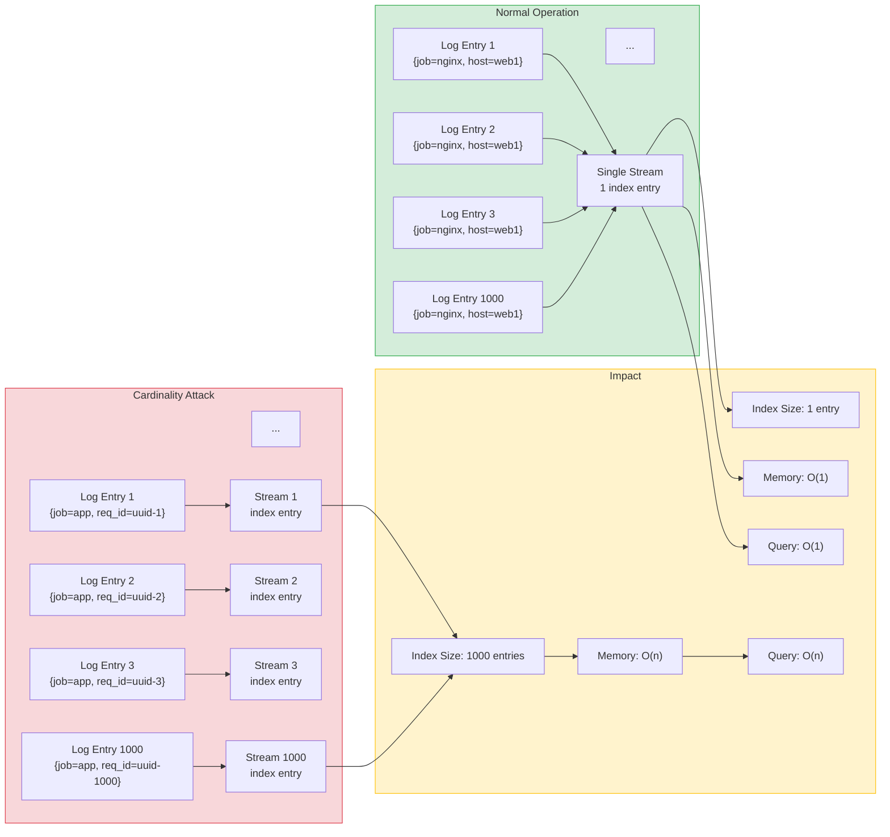
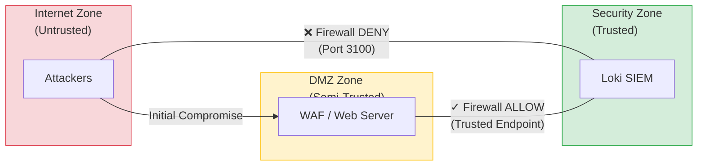
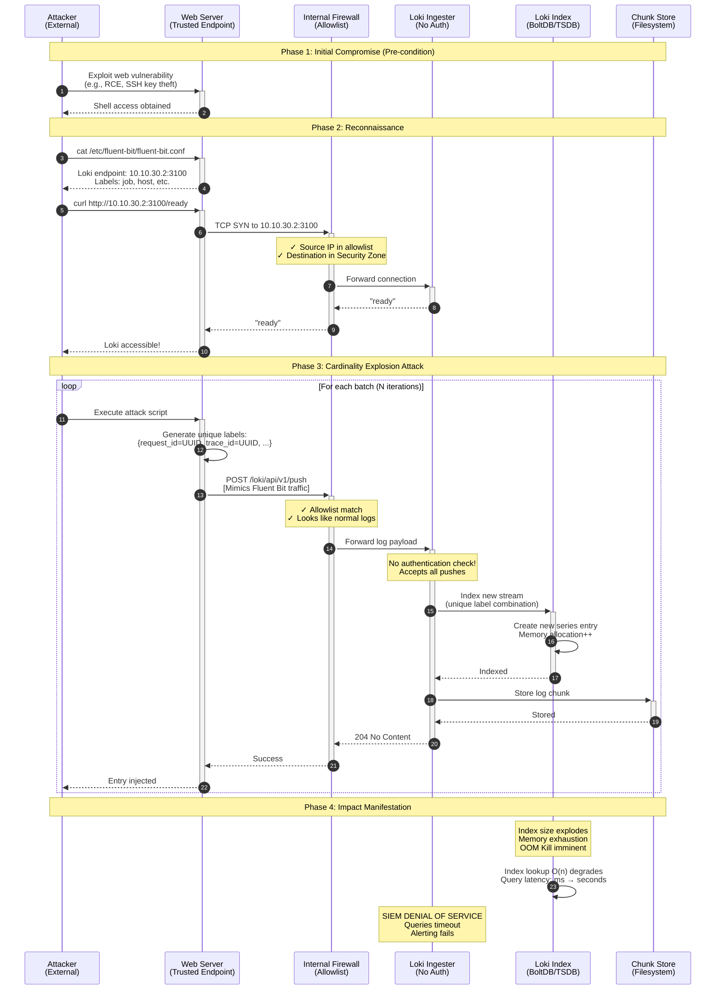
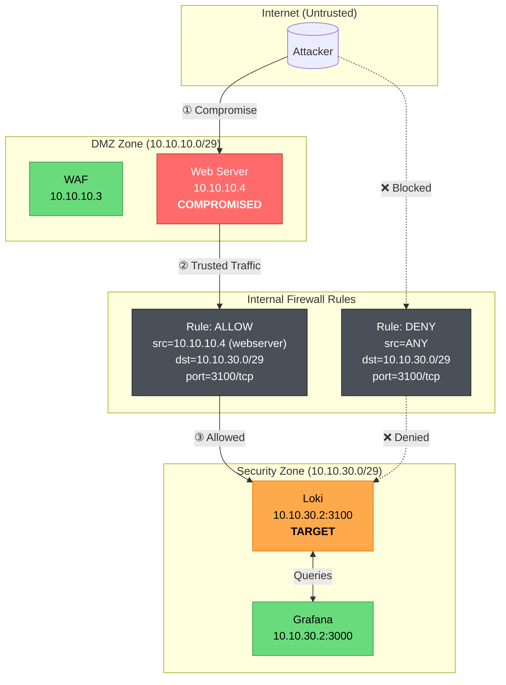
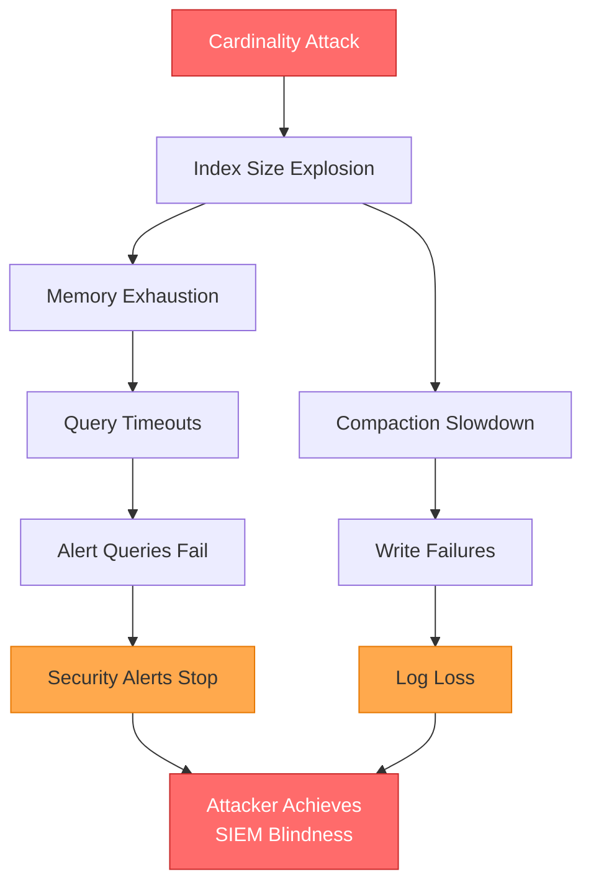
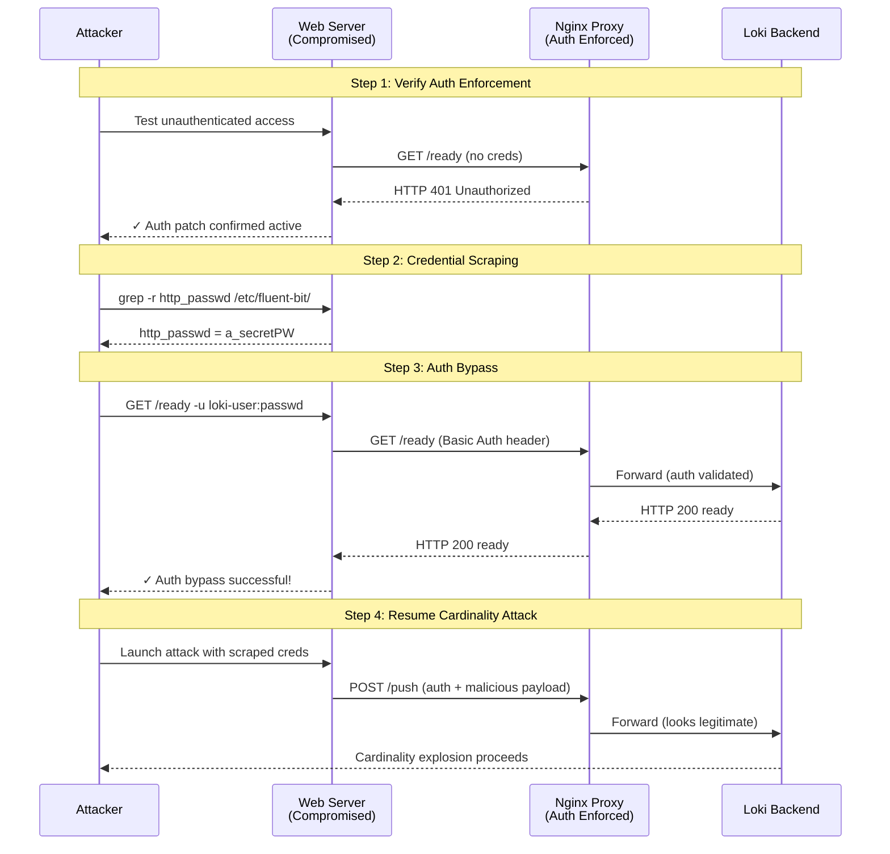

# Loki Cardinality Explosion Attack: Technical Analysis Report

**Document Version:** 3.0  
**Classification:** Red Team Assessment  
**Date:** 2025-11-30  
**Author:** Security Research Team  

---

## Table of Contents

1. [Executive Summary](#1-executive-summary)
2. [Attack Classification and Theoretical Foundation](#2-attack-classification-and-theoretical-foundation)
   - 2.1 [Cardinality Explosion Mechanism](#21-cardinality-explosion-mechanism)
   - 2.2 [Index Growth Analysis](#22-index-growth-analysis)
   - 2.3 [MITRE ATT&CK Classification](#23-mitre-attck-classification)
   - 2.4 [Related Vulnerabilities](#24-related-vulnerabilities)
3. [Attack Prerequisites and Trust Model](#3-attack-prerequisites-and-trust-model)
   - 3.1 [Network Trust Architecture](#31-network-trust-architecture)
   - 3.2 [Initial Access Requirements](#32-initial-access-requirements)
4. [Attack Methodology](#4-attack-methodology)
   - 4.1 [Attack Sequence](#41-attack-sequence)
   - 4.2 [Network Flow Analysis](#42-network-flow-analysis)
   - 4.3 [Technical Implementation](#43-technical-implementation)
   - 4.4 [Malicious Payload Structure](#44-malicious-payload-structure)
5. [Experimental Results](#5-experimental-results)
   - 5.1 [Phase 1: Baseline Attack (No Authentication)](#51-phase-1-baseline-attack-no-authentication)
   - 5.2 [Phase 2: Authentication Bypass via Credential Scraping](#52-phase-2-authentication-bypass-via-credential-scraping)
   - 5.3 [Impact Projections](#53-impact-projections)
6. [Countermeasure Analysis](#6-countermeasure-analysis)
   - 6.1 [Blue Team Mitigation: Reverse Proxy Authentication](#61-blue-team-mitigation-reverse-proxy-authentication)
   - 6.2 [Countermeasure Bypass: Credential Scraping](#62-countermeasure-bypass-credential-scraping)
   - 6.3 [Root Cause Analysis](#63-root-cause-analysis)
7. [Conclusions and Recommendations](#7-conclusions-and-recommendations)
8. [Appendix: Technical Artifacts](#8-appendix-technical-artifacts)

---

## 1. Executive Summary

This report documents a Red Team assessment of a Grafana Loki SIEM deployment within a segmented enterprise network. The assessment identified a critical vulnerability in the logging infrastructure that permits a **cardinality explosion attack**, resulting in denial of service against the centralized security monitoring system.

**Key Findings:**

| Metric | Phase 1 (No Auth) | Phase 2 (Auth Bypass) |
|--------|-------------------|----------------------|
| Memory Increase | +757.8% | +337.1% |
| Streams Injected | 5,000 | 5,000 |
| Attack Duration | 14.60 seconds | 11.24 seconds |
| Success Rate | 100% | 100% |

The attack exploits the trust relationship between log-forwarding endpoints and the centralized SIEM, bypassing perimeter defenses by leveraging a compromised trusted host. Even after Blue Team deployment of HTTP Basic Authentication, the attack remained viable through credential scraping from local Fluent Bit configurations.

**Attack Classification:** T1565.001 (Stored Data Manipulation), T1499.003 (Application Exhaustion Flood)

---

## 2. Attack Classification and Theoretical Foundation

### 2.1 Cardinality Explosion Mechanism

A cardinality explosion attack exploits the fundamental architecture of time-series databases (TSDBs) used in modern SIEM systems. In Grafana Loki, logs are organized into **streams** identified by unique label combinations. Under normal operation, logs with identical labels aggregate into a single stream, maintaining constant index overhead regardless of log volume.

The attack subverts this design by injecting logs with **high-cardinality labels**—labels containing unique values per entry (e.g., UUIDs). This forces the creation of a new stream for each log entry, causing exponential growth in index size and memory consumption.



**Figure 2.1:** Cardinality explosion mechanism comparing normal log aggregation (O(1) complexity) versus attack-induced stream proliferation (O(n) complexity).

### 2.2 Index Growth Analysis

The index growth rate scales multiplicatively with the number of high-cardinality label fields employed. Adding a second randomized field increases the theoretical maximum cardinality from n to n².

| Scenario | Label Structure | Unique Streams | Index Growth |
|----------|-----------------|----------------|--------------|
| Normal | `{job="nginx", host="web1"}` | 1 | Constant |
| Attack (1K) | `{job="app", request_id="uuid-*"}` | 1,000 | 1,000× |
| Attack (100K) | `{job="app", request_id="uuid-*", trace_id="uuid-*"}` | 100,000 | 100,000× |

**Table 2.1:** Index growth scaling based on high-cardinality label field count.

### 2.3 MITRE ATT&CK Classification

| Technique ID | Technique Name | Applicability |
|--------------|----------------|---------------|
| **T1565.001** | Stored Data Manipulation | Corruption of SIEM index integrity |
| **T1499.003** | Application Exhaustion Flood | Resource exhaustion via stream proliferation |

### 2.4 Related Vulnerabilities

This attack exploits a class of misconfiguration vulnerabilities in centralized logging infrastructure. Related CVEs include:

- **CVE-2022-35957:** Grafana Loki Authentication Bypass
- **General Class:** Misconfigured Centralized Logging Infrastructure (unauthenticated ingestion endpoints)

---

## 3. Attack Prerequisites and Trust Model

### 3.1 Network Trust Architecture

Unlike perimeter-focused attacks (e.g., WAF DoS), this attack exploits the **implicit trust relationship** between internal log forwarders and the centralized SIEM. Firewall rules explicitly permit traffic from trusted endpoints to the security zone, creating an attack vector invisible to perimeter defenses.



**Figure 3.1:** Trust relationship architecture. Direct attacker access is blocked; however, compromised trusted endpoints inherit logging permissions.

### 3.2 Initial Access Requirements

**Prerequisite:** The attacker must have compromised a Fluent Bit instance on a trusted endpoint (e.g., web server in the DMZ). This initial compromise (Phase 1) is assumed to have occurred via a separate attack vector (RCE, SSH key theft, etc.) and is not further discussed in this report.

**Distinction from Perimeter Attacks:**

| Attack Type | Trust Relationship | Network Path |
|-------------|-------------------|--------------|
| WAF DoS | Untrusted → DMZ | Internet → WAF |
| **Cardinality Explosion** | Trusted → Security Zone | Compromised Host → SIEM |

---

## 4. Attack Methodology

### 4.1 Attack Sequence

The attack proceeds through four distinct phases following initial compromise:



**Figure 4.1:** Complete attack sequence diagram from initial compromise through denial of service manifestation.

### 4.2 Network Flow Analysis

The attack leverages legitimate firewall rules to route malicious traffic through trusted network paths:



**Figure 4.2:** Network flow diagram illustrating attack path through trusted endpoint versus blocked direct access.

### 4.3 Technical Implementation

The attack is implemented via the `loki_cardinality_attack.py` script, which provides:

| Feature | Description |
|---------|-------------|
| **Fluent Bit Impersonation** | Mimics legitimate log forwarder traffic patterns |
| **Label Randomization** | Generates UUID-based labels per entry |
| **Batch Processing** | Efficient multi-threaded injection |
| **Attack Modes** | `safe` (5 PoC entries), `cardinality` (index explosion), `integrity` (fake alert injection), `full` (combined) |

**Modular Benchmark Suite:**

```
attacks/loki_stages/
├── 00_reset.sh      # Environment reset (./setup.sh restart)
├── 01_baseline.sh   # Pre-attack metrics capture
├── 02_attack.sh     # Launch cardinality attack
├── 03_verify.sh     # Post-attack verification
└── run_benchmark.sh # Master orchestrator
```

**Execution Commands:**

```bash
# Complete benchmark with environment reset
./attacks/loki_stages/run_benchmark.sh

# Skip environment reset (use existing containers)
./attacks/loki_stages/run_benchmark.sh --skip-reset

# Individual stage execution
./attacks/loki_stages/01_baseline.sh
./attacks/loki_stages/02_attack.sh
./attacks/loki_stages/03_verify.sh
```

### 4.4 Malicious Payload Structure

Each HTTP POST to `/loki/api/v1/push` contains a payload with randomized high-cardinality labels:

```json
{
  "streams": [{
    "stream": {
      "job": "application",
      "env": "production",
      "request_id": "550e8400-e29b-41d4-a716-446655440000",
      "trace_id": "7f3d8c2a-1b4e-4f5d-9a8b-3c6d7e8f9a0b",
      "span_id": "a1b2c3d4e5f6",
      "instance": "host-8f3a2c1d",
      "pod": "pod-7e9f8a6b3c2d"
    },
    "values": [
      ["1732838400000000000", "level=info msg=\"Normal log entry\""]
    ]
  }]
}
```

Each push creates a **new unique stream** because `request_id`, `trace_id`, `span_id`, `instance`, and `pod` are randomized per entry.

---

## 5. Experimental Results

### 5.1 Phase 1: Baseline Attack (No Authentication)

**Test Environment:** Grafana Loki with default configuration (no authentication on ingestion endpoint).

**Memory Impact (Container-Level):**

| Metric | Value |
|--------|-------|
| Baseline Memory | 46.25 MiB |
| Post-Attack Memory | 404.8 MiB |
| Memory Delta | **+357.60 MiB** |
| Percentage Increase | **+757.8%** |

**Stream Cardinality Impact (Loki Ingester):**

| Metric | Value |
|--------|-------|
| Baseline Active Streams | 16 |
| Post-Attack Active Streams | 5,000 |
| New Streams Created | **4,984** |
| Attack-Specific Streams | 4,975 (`job="application"`) |

**Attack Performance Metrics:**

| Metric | Value |
|--------|-------|
| Attack Duration | 14.60 seconds |
| Injection Rate | 340.75 entries/second |
| Success Rate | **100%** |

**Visual Impact Summary:**

```
MEMORY CONSUMPTION
──────────────────────────────────────────────────────────────────────────
Baseline   │████                                                    │  46 MiB
Post-Attack│████████████████████████████████████████████████████████│ 405 MiB
──────────────────────────────────────────────────────────────────────────
                              +757.8% INCREASE

ACTIVE STREAMS (Cardinality)
──────────────────────────────────────────────────────────────────────────
Baseline   │▌                                                       │    16
Post-Attack│████████████████████████████████████████████████████████│ 5,000
──────────────────────────────────────────────────────────────────────────
                              +31,150% INCREASE
```

### 5.2 Phase 2: Authentication Bypass via Credential Scraping

Following Blue Team deployment of HTTP Basic Authentication (see Section 6), the attack was re-executed using scraped credentials.

**Authentication Verification:**

| Test | Result |
|------|--------|
| Unauthenticated `/ready` | HTTP 401 Unauthorized ✓ |
| Authenticated `/ready` (scraped creds) | HTTP 200 OK ✓ |
| Unauthenticated push | HTTP 401 Unauthorized ✓ |
| Authenticated push (scraped creds) | HTTP 204 No Content ✓ |

**Attack Impact (With Auth Bypass):**

| Metric | Baseline | Post-Attack | Delta |
|--------|----------|-------------|-------|
| Container Memory | 98.14 MiB | 430.8 MiB | **+332.55 MiB (+337.1%)** |
| Ingester Streams | 0 | 5,000 | **+5,000** |
| Attack Duration | — | 11.24 seconds | — |
| Injection Rate | — | 440.88 entries/sec | — |

**Console Output (Key Excerpts):**

```
[PHASE2] Testing if Blue Team auth patch is in place...
[PHASE2] ✓ CONFIRMED: Endpoint requires authentication (HTTP 401)
[PHASE2]   Blue Team patch is ACTIVE

[PHASE2] Scraping credentials from local Fluent Bit configuration...
[PHASE2] ✓ CREDENTIALS SCRAPED SUCCESSFULLY!
[PHASE2]   Username: loki-user
[PHASE2]   Password: a_se****ecEt

[*] Verifying connectivity to http://10.10.30.2:3100
    [*] Phase 2: Testing unauthenticated access first...
    [+] CONFIRMED: Endpoint requires authentication (HTTP 401)
        Blue Team patch is in place!
    [+] Loki /ready endpoint: OK
    [!] AUTH BYPASS SUCCESSFUL: Scraped credentials valid!
    [+] Push API accessible: CONFIRMED
    [!] VULNERABILITY: Auth bypass via credential scraping!
```

### 5.3 Impact Projections

**Scaling Analysis (Theoretical Projections):**

| Metric | Before Attack | After 5K Streams | After 100K Streams (Projected) |
|--------|---------------|------------------|-------------------------------|
| Index Size | ~1 MB | ~50 MB | ~500 MB |
| Query Latency (p99) | 50ms | 5000ms+ | **Timeout** |
| Memory Usage | 46 MiB | 405 MiB | **OOM Kill** |
| Active Streams | ~16 | ~5,000 | ~50,000 |

**Impact Chain Analysis:**



**Figure 5.1:** Attack impact cascade leading to SIEM blindness.

**Operational Consequences:**

| Impact Category | Description |
|-----------------|-------------|
| Security Monitoring Blindness | Alerts stop firing during attack |
| Incident Response Degradation | Cannot query historical logs |
| Compliance Violations | Log integrity compromised (audit failures) |
| Resource Costs | Emergency scaling or infrastructure replacement |

---

## 6. Countermeasure Analysis

### 6.1 Blue Team Mitigation: Reverse Proxy Authentication

The Blue Team deployed an Nginx reverse proxy with HTTP Basic Authentication to restrict access to the Loki ingestion endpoint:

| Component | Before (Phase 1) | After (Phase 2) |
|-----------|------------------|-----------------|
| Loki Access | Direct to `:3100` | Via Nginx proxy on `:3100` |
| Authentication | None | HTTP Basic Auth |
| Config Location | `loki-config.yaml` | `nginx/nginx.conf` + `.htpasswd` |

**Nginx Configuration:**

```nginx
server {
    listen 10.10.30.2:3100;
    auth_basic "SIEM Log Ingestion - Authorized Personnel Only";
    auth_basic_user_file /etc/nginx/.htpasswd;
    
    location / {
        proxy_pass http://127.0.0.1:3100;
    }
}
```

### 6.2 Countermeasure Bypass: Credential Scraping

Since the trusted endpoint (web_server) must forward logs legitimately, its Fluent Bit configuration contains valid credentials:

```ini
# /etc/fluent-bit/pipelines/ssh-logs.conf (on web_server)
[OUTPUT]
    Name             loki
    Host             10.10.30.2
    Port             3100
    http_user        loki-user           # ← SCRAPED
    http_passwd      a_secretPW#15secEt  # ← SCRAPED
```

**Bypass Sequence:**



**Figure 6.1:** Authentication bypass via credential scraping from compromised endpoint.

### 6.3 Root Cause Analysis

The authentication countermeasure addresses **unauthorized host access** but fails to mitigate attacks from **already-trusted hosts**. The fundamental vulnerability persists:

| Defense Layer | Status | Gap |
|---------------|--------|-----|
| Host Authentication | ✓ Implemented | Credentials stored in plaintext on trusted hosts |
| Rate Limiting | ✗ Not Implemented | No restriction on stream creation rate |
| Cardinality Limits | ✗ Not Implemented | No cap on unique label combinations |
| Credential Protection | ✗ Not Implemented | Fluent Bit configs readable by attackers |

---

## 7. Conclusions and Recommendations

### 7.1 Findings Summary

1. **Vulnerability Confirmed:** Grafana Loki's default configuration permits cardinality explosion attacks, causing +757.8% memory increase and potential denial of service.

2. **Trust Model Exploitation:** The attack bypasses perimeter defenses by leveraging compromised trusted endpoints with legitimate logging permissions.

3. **Countermeasure Insufficiency:** HTTP Basic Authentication is trivially bypassed via credential scraping from local Fluent Bit configurations.

### 7.2 Recommendations

| Priority | Recommendation | Implementation |
|----------|----------------|----------------|
| **Critical** | Implement cardinality limits | `max_label_names_per_series`, `max_streams_per_user` in Loki config |
| **Critical** | Deploy rate limiting | Configure `ingestion_rate_mb` and `ingestion_burst_size_mb` |
| **High** | Encrypt credential storage | Use HashiCorp Vault or Kubernetes secrets for Fluent Bit credentials |
| **High** | Implement mutual TLS | Replace Basic Auth with client certificate authentication |
| **Medium** | Deploy anomaly detection | Alert on sudden stream count increases |
| **Medium** | Restrict filesystem permissions | Limit access to `/etc/fluent-bit/` directories |

---

## 8. Appendix: Technical Artifacts

### 8.1 File Locations

| File | Description |
|------|-------------|
| `attacks/loki_stages/run_benchmark.sh` | Master benchmark orchestrator |
| `attacks/loki_stages/00_reset.sh` | Environment reset stage |
| `attacks/loki_stages/01_baseline.sh` | Pre-attack metrics capture |
| `attacks/loki_stages/02_attack.sh` | Attack execution stage |
| `attacks/loki_stages/03_verify.sh` | Post-attack verification |
| `attacks/loki_attack_wrapper.sh` | Legacy attack automation wrapper |
| `attacks/python-scripts/loki_cardinality_attack.py` | Core attack script |
| `attacks/logs/loki_attack_*.log` | Attack execution logs |
| `config/siem/loki-config-secure.yaml` | Hardened Loki configuration |
| `config/fluent-bit/examples/loki-authenticated.conf` | Authenticated Fluent Bit config |

### 8.2 Attack Execution Quick Reference

```bash
# Full benchmark (recommended)
./attacks/loki_stages/run_benchmark.sh

# Skip environment reset
./attacks/loki_stages/run_benchmark.sh --skip-reset

# Direct attack execution
docker exec clab-security_lab-web_server python3 \
    /tmp/loki_cardinality_attack.py \
    --target http://10.10.30.2:3100 \
    --mode cardinality \
    --entries 5000
```

---

**Document Control:**

| Version | Date | Author | Changes |
|---------|------|--------|---------|
| 1.0 | 2025-11-28 | Security Research Team | Initial Phase 1 documentation |
| 2.0 | 2025-11-29 | Security Research Team | Added Phase 2 (auth bypass) |
| 3.0 | 2025-11-30 | Security Research Team | Formal analysis report format |

---

*End of Report*
